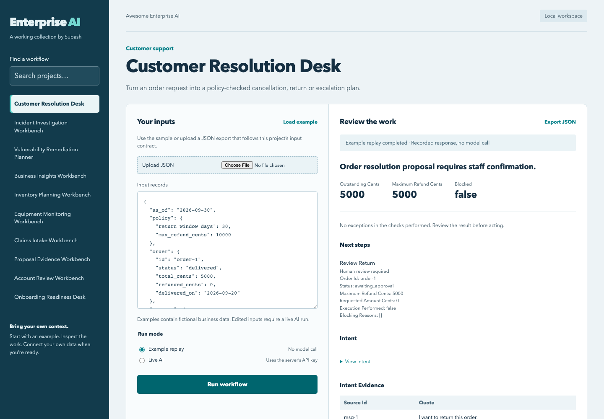

<div align="center">

# Awesome Enterprise AI

### Practical AI for the work inside an enterprise

Open-source workflows for customer service, operations, security and business teams.

[Explore the collection](#choose-your-workflow) · [Run the workspace](#try-it-in-two-minutes) · [Adoption guide](ADOPTION.md) · [What we tested](docs/VERIFICATION.md) · [Quality scores](docs/QUALITY.md)

</div>



## Built around the work

I love coding, especially when it helps untangle a problem that keeps coming back. A support team chasing the right policy. An engineer piecing together an incident. An adjuster waiting for one missing document.

I use this collection to work through those problems from first principles: who needs help, what decision are they making, and where does AI actually earn its place? I care about the surrounding workflow as much as the model. Each project gives you runnable code, examples you can inspect, and a clear account of what still needs work before you connect it to your systems.

**Current stage: nine reviewed reference workflows and two experimental projects.** All eleven have a browser journey, CLI, examples and tests. Proposal Evidence and Data Repair Evidence remain experimental pending target-environment acceptance. They are not complete replacements for enterprise systems or pre-certified deployments. [Read the tested scope and remaining limits.](docs/VERIFICATION.md)

## Choose your workflow

| Team / problem | Project | What you get |
|---|---|---|
| Support: an order request needs the right policy and action | [Customer Resolution Desk](projects/customer-resolution/) | A checked return, cancellation or escalation proposal; no automatic refund |
| IT: incident evidence is scattered and causes are uncertain | [Incident Investigation Workbench](projects/incident-operations/) | An ordered timeline, competing hypotheses, contradictions and missing checks |
| Security: scanner findings need inventory and advisory context | [Vulnerability Remediation Planner](projects/exposure-review/) | Exact version matches, unknowns, advisory context and owner review |
| Business: a question needs an agreed metric and traceable answer | [Business Insights Workbench](projects/business-insights/) | A reviewable analysis plan, exact totals and contributing record IDs |
| Supply chain: replenishment decisions compete for a limited budget | [Inventory Planning Workbench](projects/inventory-decisions/) | Transparent reorder proposals, budget constraints and planning-note interpretation |
| Operations: equipment alerts need recent readings and history | [Equipment Monitoring Workbench](projects/asset-operations/) | Persistent threshold observations, stale-data findings and maintenance context |
| Insurance: incomplete evidence delays an adjuster’s review | [Claims Intake Workbench](projects/claims-intake/) | A document checklist, conflicting facts and missing-information requests |
| Data operations: a green job may not prove a repair | [Data Repair Evidence](projects/data-repair-evidence/) · experimental | Same-scope retest checks, declared consumer lineage and a review handoff; optional AI sentence prioritization |
| Proposals: answers must match current, approved evidence | [Proposal Evidence Workbench](projects/proposal-operations/) · experimental | A sourced response matrix and local review ledger that withholds changed or expired answers |
| Sales: meeting commitments and CRM records drift apart | [Account Review Workbench](projects/account-intelligence/) | Quoted observations, date conflicts and missing next steps; no invented forecast |
| People operations: onboarding tasks depend on each other | [Onboarding Readiness Desk](projects/workforce-onboarding/) | Applicable tasks, prerequisite gaps and a readiness checklist |

### Also in the collection

- **[RAG Scope Check](projects/rag-scope-check/)**: verify permission boundaries and whether entitled users can still find useful answers.
- **[Invoice Exception Brief](projects/invoice-exception-brief/)**: assemble the evidence behind a blocked supplier invoice.

## Try it in two minutes

Python **3.11+**. No third-party Python packages are required for the workflow workspace.

```sh
git clone https://github.com/suboss87/awesome-enterprise-ai.git
cd awesome-enterprise-ai
python3 -m enterprise_ai serve
```

Open **http://127.0.0.1:8765**. Pick a workflow, run its example, inspect the findings, and export the result.

**Example replay** uses a recorded response and makes no model call. **Live AI** analyzes your supplied records through the configured provider. The interface always labels which mode produced the result.

To use live AI, configure `OPENAI_API_KEY` in the server environment and restart the workspace. Provider access and usage charges apply. Read [data handling and deployment](docs/DEPLOYMENT.md) before sending business data.

### Prefer the command line?

```sh
python3 -m enterprise_ai list
python3 -m enterprise_ai run customer-resolution \
  --input projects/customer-resolution/examples/input.json \
  --mode replay --responses projects/customer-resolution/examples/responses.json
python3 scripts/verify_workflows.py
```

Use `--mode live` without `--responses` for actual inference. Live failures produce errors; they never quietly become example replays.

## A consistent starting point

```text
projects/<workflow>/
├── README.md                 # Business problem, quickstart, contract and limits
├── workflow.py               # Model interpretation and explicit business rules
├── examples/                 # Fictional inputs and recorded model responses
├── evaluation/cases.json     # Declared outcomes and failure cases
└── tests/                    # Business-rule and evidence-boundary checks
enterprise_ai/                # Shared CLI, provider and local browser workspace
```

The workflow interprets text where interpretation helps. Ordinary code handles arithmetic, date windows, prerequisites and exact matching. Results preserve uncertainty and require human review. None of these workflows writes to a CRM, ERP, claim system or infrastructure control plane.

## Adopt one small piece

1. Choose a task your team already performs and record its current result.
2. Run the example; read the project’s input contract and limits.
3. Map an authorized export from your system and test representative cases.
4. Review correctness, access control and operational requirements before connecting production systems.

[Adoption guide](ADOPTION.md) · [Integration roadmap](docs/ADOPTION-ROADMAP.md) · [Deployment boundary](docs/DEPLOYMENT.md) · [Verification and evaluation](docs/VERIFICATION.md)

## Keep improving the collection

Useful additions solve a distinct, recurring problem. Improvements to an existing workflow count too: better evidence, an adapter that really works, clearer failure behavior, or a smaller setup burden.

I’m growing this toward 20–30 useful projects. I look for repeated problems in community discussions and real enterprise work, then check what existing tools already solve. Reuse should keep its attribution and add something useful. Daily CI reruns the checks; new projects need their own evaluations, governance decisions and a documented deployment path.

[Quality rubric and current scores](docs/QUALITY.md) · [Production acceptance](quality/README.md)

[Suggest a problem](CONTRIBUTING.md) · [Verification runs](https://github.com/suboss87/awesome-enterprise-ai/actions/workflows/verify.yml) · [Report a vulnerability](SECURITY.md)

---

Built by [Subash Natarajan](https://github.com/suboss87) · [MIT license](LICENSE)
