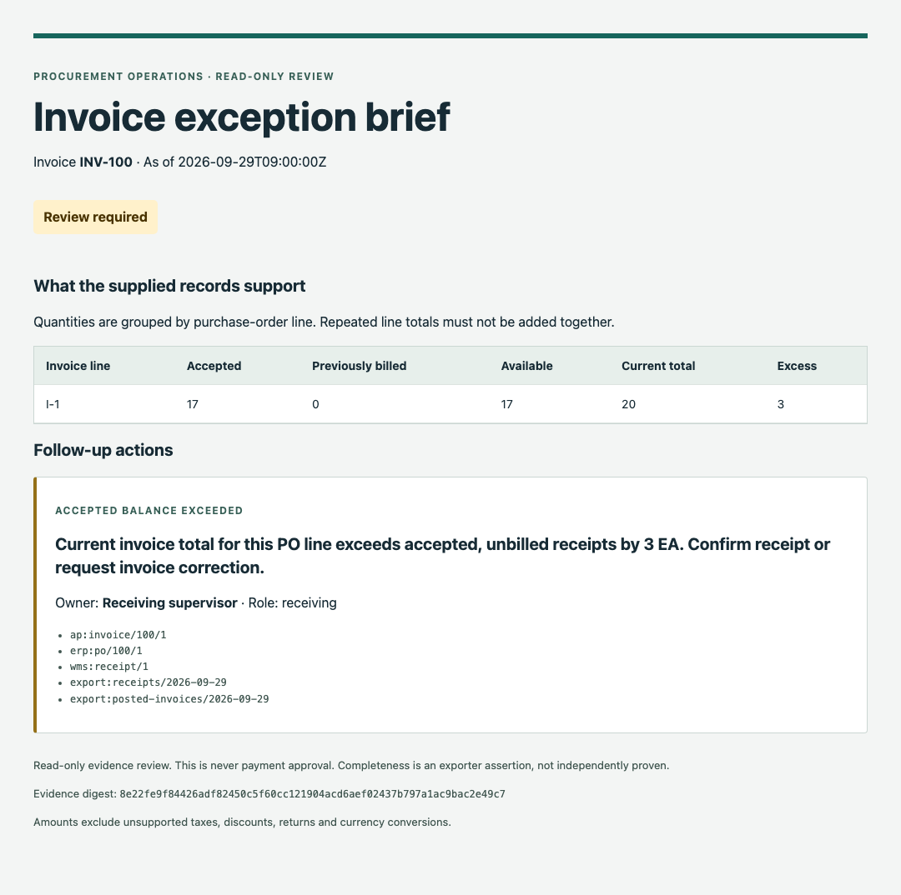

# Invoice Exception Brief

**Turn a blocked supplier invoice into a clear receiving, procurement and finance handoff.**

A supplier says twenty items were delivered. The warehouse accepted seventeen and rejected three. Or ten were accepted, eight were already billed, and another invoice asks for eight. Someone in accounts payable needs the precise discrepancy, its source records and the person who can resolve it.

This local workflow checks **accepted, unbilled quantities by purchase-order line** and prepares a readable review brief. It addresses a procurement pattern shared by manufacturing, distribution and retail. It is a runnable reference implementation, tested on synthetic records; it has no customer deployment evidence.



*Actual output from the included fictional partial-receipt example.*

## Try it

Python 3.10 or newer. No packages, credentials or model required.

```sh
git clone https://github.com/suboss87/awesome-enterprise-ai.git
cd awesome-enterprise-ai/projects/invoice-exception-brief
```

Then run:

```sh
python3 -m invoice_exception_brief examples/clean.json
python3 -m invoice_exception_brief examples/partial_receipt.json --format html > /tmp/invoice-brief.html
python3 -m invoice_exception_brief examples/prior_consumption.json
python3 -m unittest discover -s tests -v
```

The second and third commands intentionally return **1** because review is required. Run them separately if your shell stops on a nonzero exit. Open `/tmp/invoice-brief.html` in a browser. The brief is self-contained and makes no network requests.

| Example | Business situation | Expected outcome |
| --- | --- | --- |
| `clean.json` | Twenty accepted, twenty billed, complete empty prior history | No exceptions in supplied evidence |
| `partial_receipt.json` | Twenty received, seventeen accepted, three rejected | Three units require review |
| `prior_consumption.json` | Ten accepted, eight previously billed, eight newly billed | Six units exceed the available balance |
| `missing_evidence.json` | Receipt and prior-invoice exports are incomplete | Available balance remains unknown |

## How a team uses it

1. Export the purchase order, accepted receipts, prior posted invoice lines and one current invoice into the documented JSON shape in `examples/clean.json`.
2. Supply responsible team names in `owners`. Mark a snapshot complete only when the exporter has checked its scope and pagination.
3. Set `as_of` to the intended evaluation timestamp and `max_age_days` to your evidence-age policy. Examples use a fixed time for reproducibility; this does **not** establish freshness today.
4. Run the check and review the HTML or JSON. Every finding retains source references; the report includes a digest of the complete normalized input.
5. Receiving confirms acceptance evidence, procurement addresses price/order changes, and accounts payable reconciles history. Update the authoritative records and export again.

The program never approves, pays, sends email or changes an ERP record. `NO_EXCEPTIONS_IN_SUPPLIED_EVIDENCE` describes only the implemented checks. It does not mean “ready to pay.”

## What is checked

- Receipts remain attached to their PO line; received quantity cannot substitute for accepted quantity.
- Prior posted invoice lines consume accepted quantity. Multiple current lines referencing one PO line are checked together, without order-dependent allocation.
- Missing or incomplete history is explicitly unresolved. Completeness is an assertion made by the exporter, not something this utility proves.
- Entity, supplier, currency and units must agree. Prices must match exactly; this version has no tolerance configuration.
- Missing owners, stale evidence and future timestamps produce review findings.
- Duplicate IDs/JSON keys, malformed decimals and unsupported fields are rejected.

Quantities and prices are decimal **strings**, with at most eighteen integer and six fractional digits. Negative values, exponents and binary JSON numbers are rejected. All calculations use an explicitly bounded decimal precision. Input is limited to 1 MB and each record collection to 1,000 rows.

## Input and integration boundary

This version accepts normalized JSON only. An extraction model or ERP exporter can produce the shape, but a trustworthy source mapping must establish entity/vendor identity, exact PO-line references, receipt acceptance, posted invoice status and complete prior history. Source references must uniquely identify individual source line records inside each snapshot; aliases with different local IDs are rejected. References are plain labels, never fetched. Only supply purchase orders eligible for this review under your existing process: PO approval state is not modeled or verified. A digest detects changes to supplied input; it does not prove authenticity, immutable storage or completeness.

Receipt records represent current accepted/rejected evidence, not a movement ledger. The exporter must exclude cancelled/reversed records and materialize the current state. Repeated IDs are rejected; revisions are not merged. One current invoice is evaluated against a snapshot. Separate concurrent runs do not reserve inventory or protect against invoices posted after the snapshot.

**Not supported:** credit notes, returns, receipt reversals, taxes, discounts, freight, exchange-rate conversion, blanket/service orders or payment execution. Do not remove these facts from a real transaction merely to fit the schema; route that case to the existing accounting process. The schema rejects extra fields but cannot detect facts an exporter hides.

## Where AI fits

This is a deterministic verification and handoff workflow for structured inputs, including inputs extracted by AI. The shipped implementation does not call an AI model. Adding generated wording is unnecessary for reliable quantities, ownership and evidence links.

## Project structure

```text
invoice_exception_brief/   validation, evidence checks, CLI and HTML rendering
examples/                 four fictional, runnable scenarios
tests/                    correctness, rejection, escaping and CLI checks
DEPLOYMENT.md             pilot integration and operating boundaries
SECURITY.md               data handling and reporting
```

The collection's MIT license applies. No third-party application code is included.
